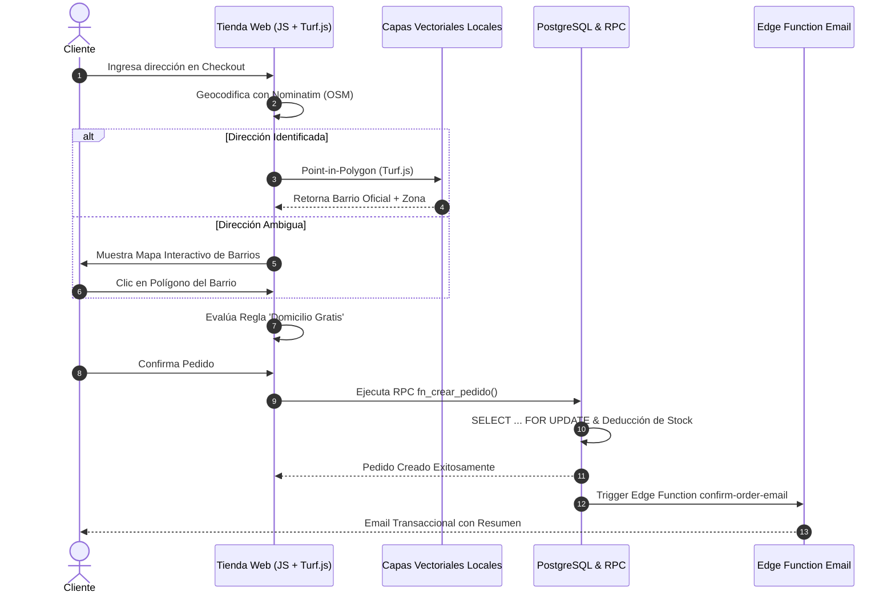

# 🐾 E-Commerce Mascotas Colombia — Plataforma Transaccional & Geoespacial

> Tienda en línea de alta conversión y catálogo para productos de mascotas y veterinaria, con control de inventario atómico en tiempo real, motor geoespacial en cliente (Turf.js + GeoJSON locales) y checkout dinámico con selección interactiva de polígonos de barrios.


---

## 📑 Tabla de Contenidos
1. [Descripción y Valor de Negocio](#-descripción-y-valor-de-negocio)
2. [Innovaciones de Arquitectura Técnica](#-innovaciones-de-arquitectura-técnica)
3. [Flujo Transaccional & Geoespacial](#-flujo-transaccional--geoespacial)
4. [Stack Tecnológico](#-stack-tecnológico)
5. [Estructura del Proyecto](#-estructura-del-proyecto)
6. [Variables de Entorno](#-variables-de-entorno)
7. [Instalación y Ejecución](#-instalación-y-ejecución)

---

## 💡 Descripción y Valor de Negocio

Este proyecto resuelve los dos mayores cuellos de botella en el comercio electrónico regional: **las condiciones de carrera en el stock** y **la imprecisión en las direcciones y costos de envío urbano**:

* **Catálogo Dinámico B2C con Soft-Filter:** Consulta en tiempo real la tabla compartida `petpro_productos` filtrando exclusivamente productos activos para B2C (`activo_b2c = true`).
* **Suscripción Realtime a Stock:** Actualizaciones instantáneas en las tarjetas de producto vía WebSockets (`postgres_changes`) sin necesidad de recargar la página.
* **Transacciones Atómicas (Cero Sobreventa):** Creación de pedidos mediante Remote Procedure Call (`fn_crear_pedido`) con bloqueo pesimista en PostgreSQL.
* **Georreferenciación 100% en Cliente:** Validación Point-in-Polygon en el navegador cruzando coordenadas con mapas catastrales GeoJSON locales, eliminando dependencias de servidores externos lentos.
* **Mapa de Barrios en Checkout:** Si la geocodificación automática falla, el usuario puede hacer clic directamente sobre su barrio en el mapa vectorial para asignarlo y calcular si aplica a la promoción de **Domicilio Gratis**.

---

## 🏗️ Innovaciones de Arquitectura Técnica

### 1. Eliminación de Deuda Técnica Espacial
Se descartó el uso de consultas lentas a bases de datos espaciales remotas (>300MB de nomenclatura catastral) y proxies costosos. Toda la validación Point-in-Polygon se ejecuta directamente en el navegador con **Turf.js** leyendo archivos vectoriales estáticos (`data/geojson/{municipio}.geojson`) para Medellín, Envigado, Itagüí, Sabaneta, La Estrella, Caldas y Bello.

### 2. Transaccionalidad Atómica con PostgreSQL RPC
Para evitar inconsistencias en el stock cuando varios clientes compran simultáneamente:
```sql
-- fn_crear_pedido aplica SELECT ... FOR UPDATE sobre el inventario
SELECT stock FROM petpro_productos WHERE id = item_id FOR UPDATE;
-- Descuenta stock y registra el pedido en una única transacción indivisible
```

---

## 🗺️ Flujo Transaccional & Geoespacial



---

## 🛠️ Stack Tecnológico

* **Frontend:** JavaScript ES6+ Modular, HTML5 Semántico, CSS3 con Design Tokens (`tokens.css`), Lucide Icons.
* **Motor Geoespacial:** Turf.js (`@turf/boolean-point-in-polygon`), OpenStreetMap Nominatim API, Capas GeoJSON Vectoriales.
* **Base de Datos & Backend:** Supabase (PostgreSQL, Realtime WebSockets, PL/pgSQL RPC Functions).
* **Emails Transaccionales:** Supabase Edge Functions (Deno Runtime) + Resend API.

---

## 📂 Estructura del Proyecto

```
ecommerce-mascotas-colombia/
├── admin/                          # Panel de control de zonas de cobertura y promociones
│   ├── dashboard.html
│   └── index.html
├── css/                            # Hojas de estilo y tokens de diseño
│   ├── styles.css
│   └── tokens.css
├── data/                           # Capas vectoriales locales GeoJSON por municipio
│   └── geojson/
│       ├── medellin.geojson
│       ├── envigado.geojson
│       ├── bello.geojson
│       └── itagui.geojson
├── docs/                           # Documentación técnica adicional
│   └── pasos.md
├── js/                             # Módulos de lógica en JavaScript ES6
│   ├── checkout.js                 # Lógica de checkout, mapa y llamada RPC
│   ├── spatial_engine.js           # Validación Point-in-Polygon con Turf.js
│   ├── products.js                 # Renderizado del catálogo y filtros
│   └── cart.js                     # Persistencia del carrito de compras
├── sql/                            # Migraciones y funciones RPC en PL/pgSQL
│   ├── 12_update_fn_crear_pedido_all_fields.sql
│   └── barrios_supabase.sql
├── scripts/                        # Scripts de mantenimiento y herramientas de ingesta
├── .env.example
├── index.html                      # Entry point principal
└── tokens.css
```

---

## 🔑 Variables de Entorno

Copia `.env.example` a `.env.local` y configura las credenciales de tu proyecto Supabase:

```bash
cp .env.example .env.local
```

---

## 💻 Instalación y Ejecución

Al estar construido sobre una arquitectura Zero-Build / Pure ES6, puedes servirlo con cualquier servidor estático:

```bash
# Opción 1: Con extensión Live Server en VS Code
# Opción 2: Con servidor local Node.js
npx serve .
```

Abre `http://localhost:3000` en tu navegador.
